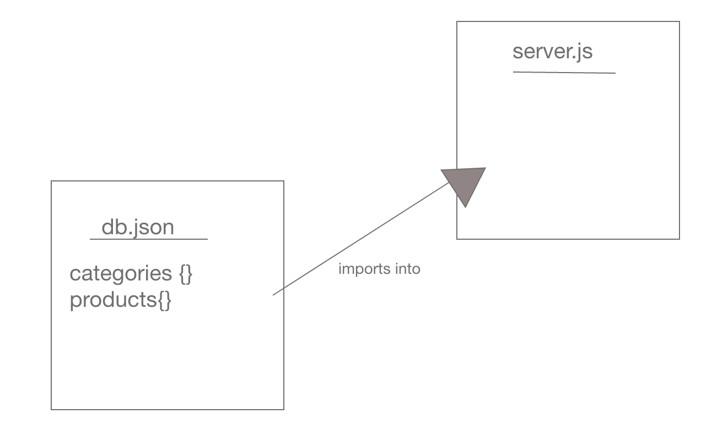

# LAB - 06

## Simple-Api

### Author: Adrian Huebner

### Links and Resources
* [submission PR](https://github.com/Adrian-Huebner-401-advanced-javascript/simple-api/pull/1)
* [travis](https://www.travis-ci.com/Adrian-Huebner-401-advanced-javascript/simple-api)
* [front-end](http://xyz.com) (when applicable)

### Setup
#### `.env` requirements
* `PORT` - Port Number

#### Running the app
* `npm start`
  

#### UML

